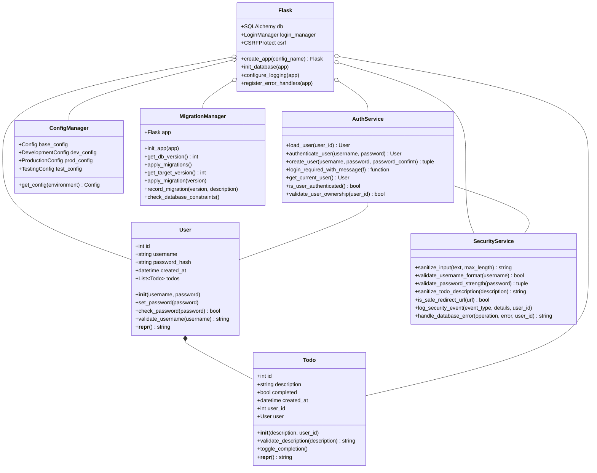
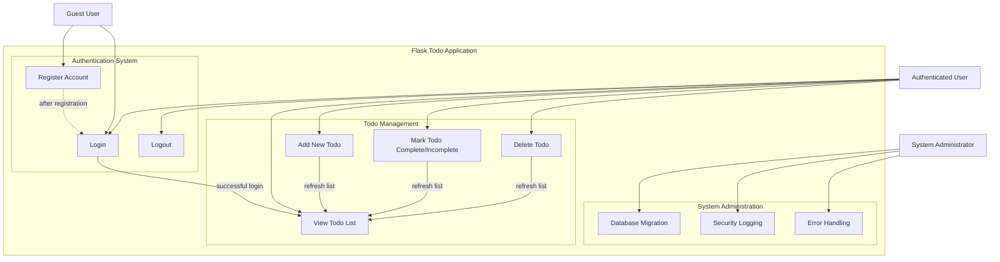
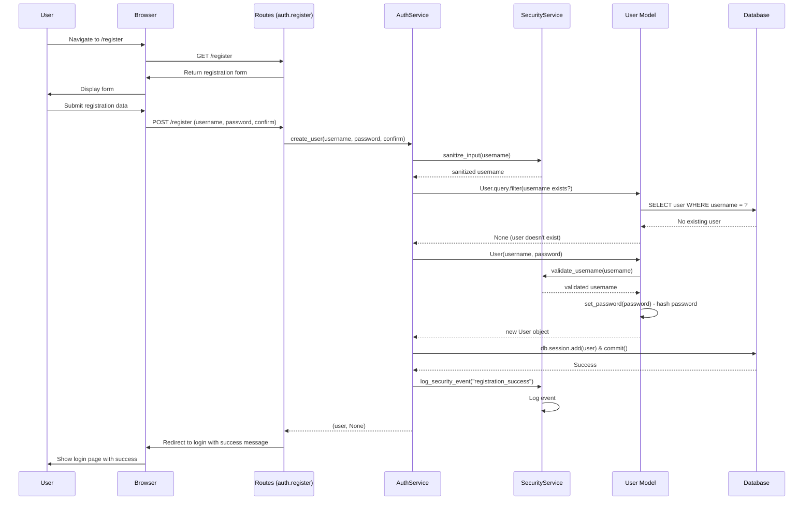
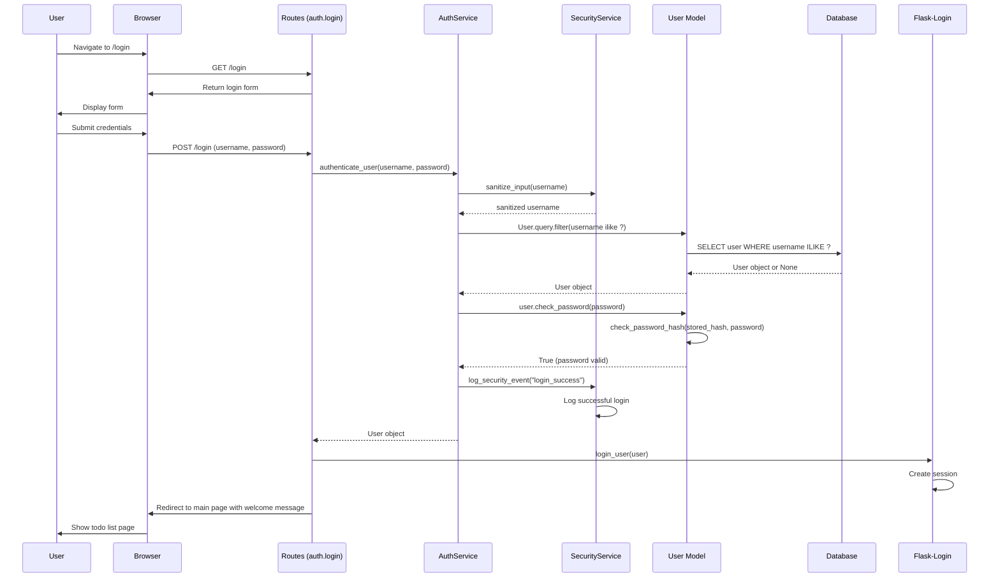
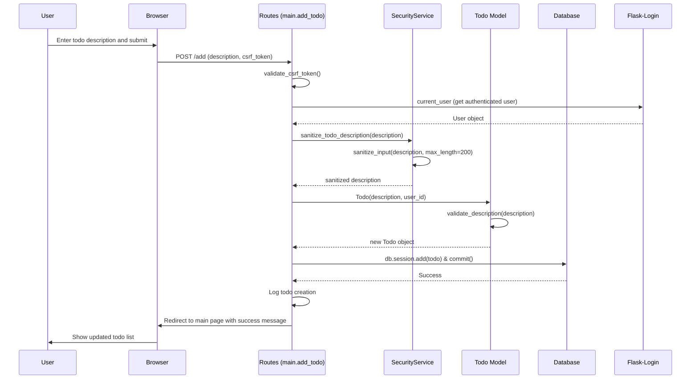
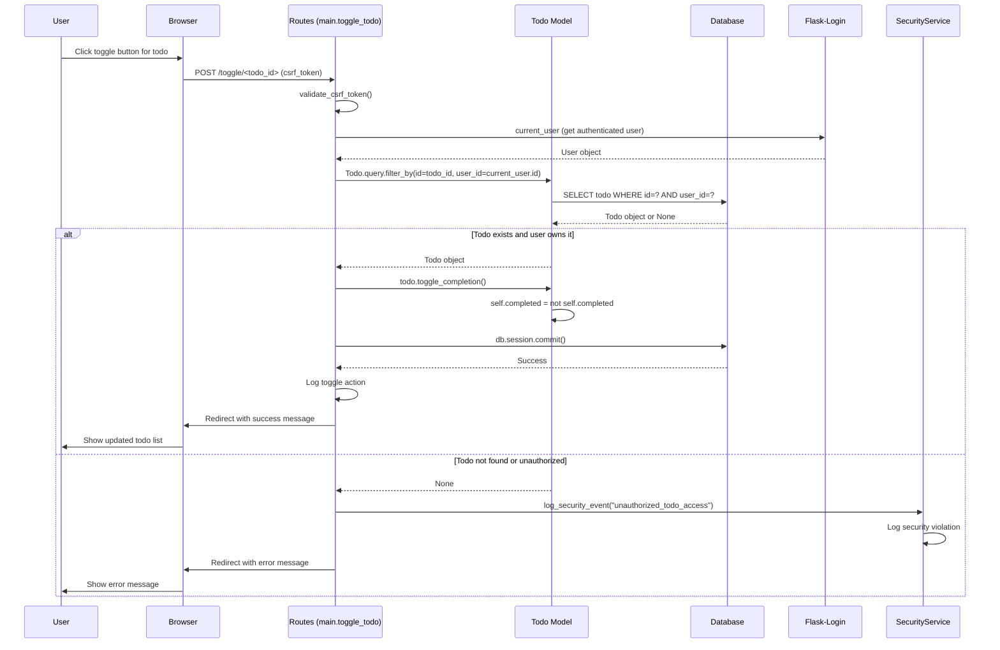
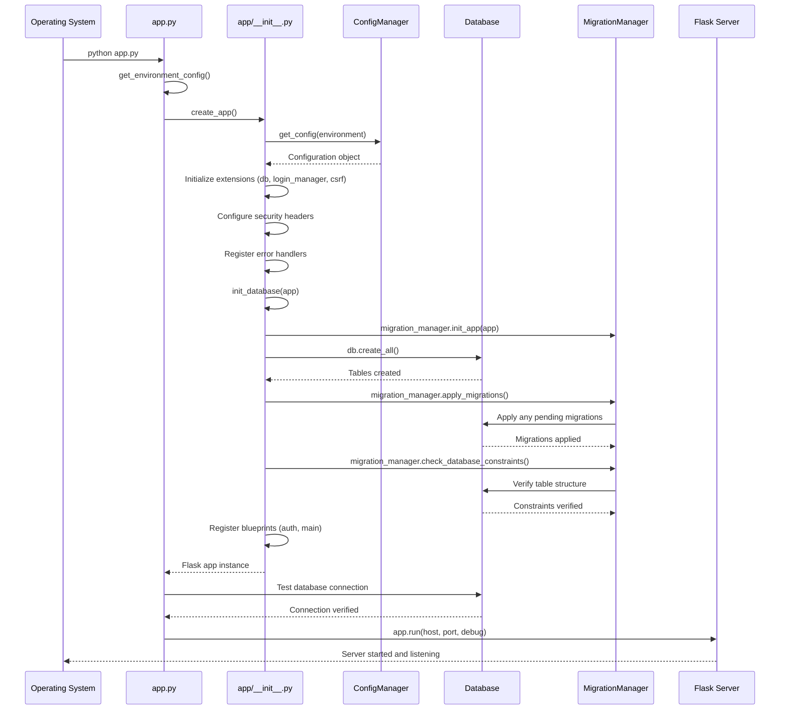
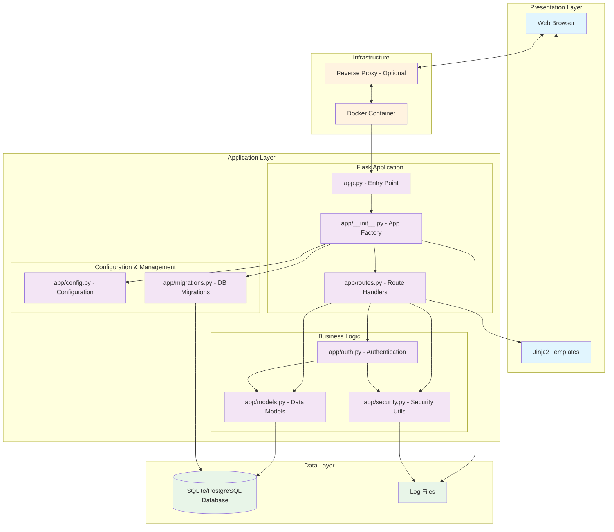
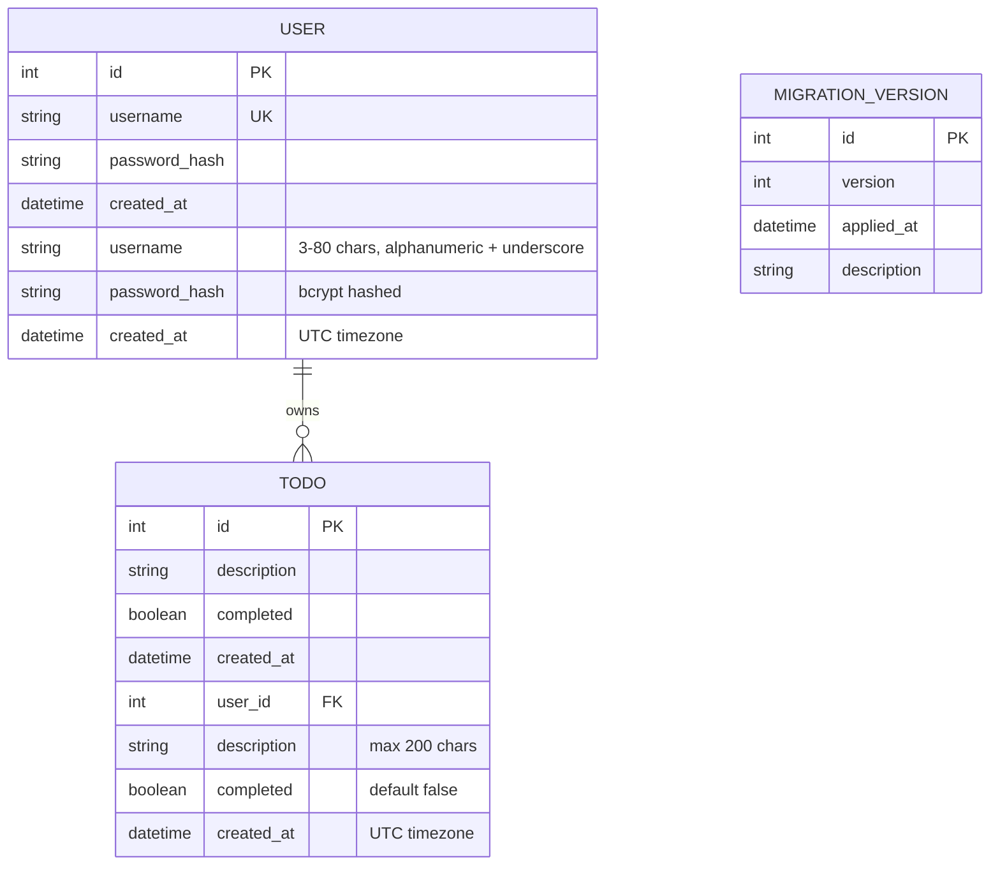
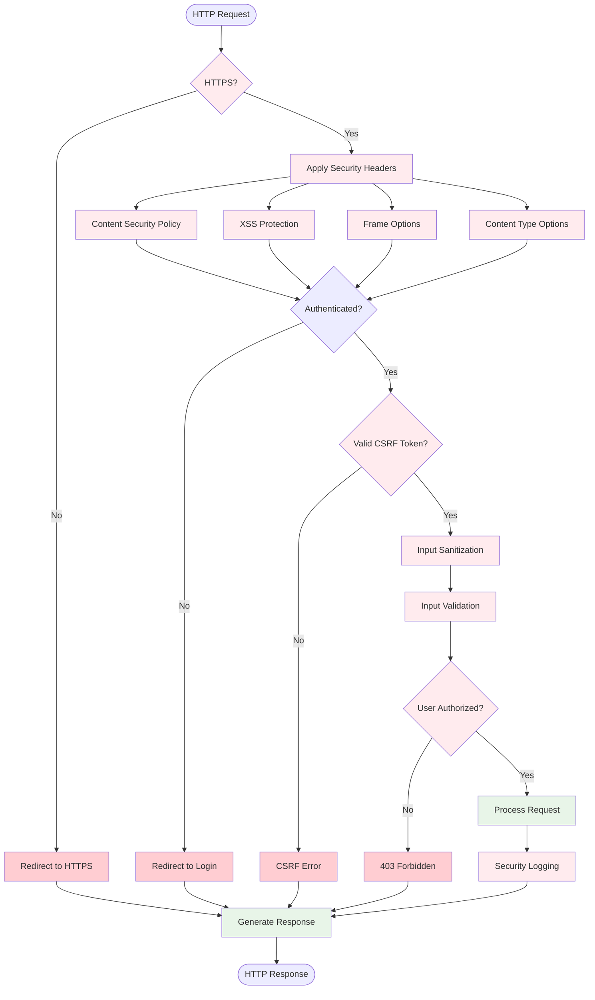

# Flask Todo App - System Diagrams

This document contains UML diagrams for the Flask Todo application using Mermaid.js.

## Class Diagram

## Use Case Diagram

## Sequence Diagrams

### User Registration Sequence

### User Login Sequence

### Add Todo Sequence

### Toggle Todo Completion Sequence

### Application Startup Sequence

## Component Architecture Diagram

## Database Entity Relationship Diagram

## Security Flow Diagram

